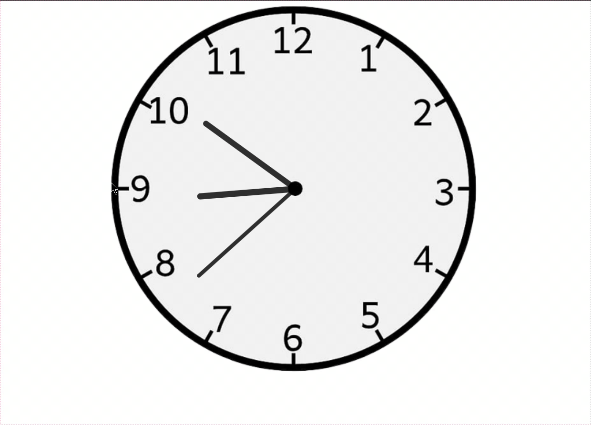

# Created an Analog Clock using pure HTML, CSS and Javascript

# Link of Analog Clock - https://rahulgit24.github.io/Analog-Clock/

<h3> It works quite well on mobile phones and various other devices as it is responsive.</h3>

<h3>Screenshot of this Clock</h3>

# Working of this Project

<h3> You can follow me on Instagram for various projects on web development and basic DSA questions</h3>

